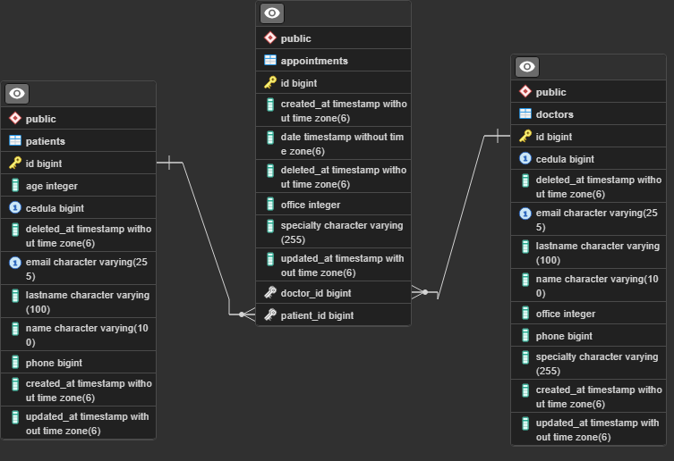

# EPS SPRING BOOT REST-API
Hi, mi name is **Deibyd** and this is my project to manage patients, doctors and appointments of an EPS.
## Prerequisite
You have to install these tools
- [JDK 17](https://www.oracle.com/java/technologies/downloads/#java17)
- [Maven](https://maven.apache.org/)
- [PostgreSQL](https://www.postgresql.org/)
- [Git](https://git-scm.com/)

## Features and Functionalities
- Get a list of the appointments, patients and doctors from the database and their information
- Create new appointments, patients and doctors in a PostgreSQL database
- Update appointments, patients and doctors
- Delete appointments, patients and doctors
- Filter appointments by patient's cedula and doctor's cedula and filter by speciality

## Tech Stack
- [PostgreSQL](https://www.postgresql.org/)
- [Spring Boot](https://spring.io/projects/spring-boot)
- [NextJS (React)](https://nextjs.org/)
- [Java](https://www.oracle.com/java/technologies/java-se-glance.html)
- [TypeScript](https://www.typescriptlang.org/)

## Data model

## Installation and running

**1. Clone this repo by running the following commands**

`git clone https://github.com/DeibydBarragan/eps-spring-rest-api.git`

**2. Then, go to the root folder and install the dependencies**

`cd eps-spring-rest-api`

`mvn clean install`

**3. Configure the application.properties file in `eps-spring-rest-api/src/main/resources/application.properties` with these values**

```
spring.datasource.url = *YOUR POSTGRESQL DATABASE URL*
spring.datasource.username = *YOUR POSTGRESQL DATABASE USERNAME*
spring.datasource.password = *YOUR POSTGRESQL DATABASE PASSWORD*
spring.jpa.properties.hibernate.dialect = org.hibernate.dialect.PostgreSQLDialect
spring.jpa.hibernate.ddl-auto = update
spring.jpa.show-sql = true
```

**4. Then, go to the root folder and run the following command**

`mvn spring-boot:run`

now you can test the API with Postman or another client with this url http://localhost:8080/api

**5. Then, in another terminal go to the root folder and run the following**

`cd webui`

`npm install`

**6. Add a .env.local file with the following**

`NEXT_PUBLIC_API_URL=http://localhost:8080/api`

**7. Now run the following command**

`npm run dev`

Then go to http://localhost:3000 and use the frontend app

## Build and run the backend API with Docker
To execute the backend app (with the postgreSQL database) in a docker container:

1. Make sure you have docker installed on your system
2. Configure the application.properties file in `eps-spring-rest-api/src/main/resources/application.properties` **exactly** like this
   ```
   spring.datasource.url = ${DATABASE_URL}
   spring.datasource.username = ${DATABASE_USERNAME}
   spring.datasource.password = ${DATABASE_PASSWORD}
   spring.jpa.properties.hibernate.dialect = org.hibernate.dialect.PostgreSQLDialect
   spring.jpa.hibernate.ddl-auto = update
   spring.jpa.show-sql = true
   ```
3. Open the root directory in the terminal and run the following

   ```shell
   mvn clean package
4. Then execute the following command
   
   ```shell
   docker-compose build java_app

5. Then run the following command:
   ```shell
   docker compose up

Now you can use the api from http://localhost:8080/api and the database from http://localhost:5432

## Build and run the frontend APP with Docker
To execute the frontend app in a docker container:

1. Make sure you have docker installed on your system, also make sure that you have the backend API running and the .env.local file configured with the port of the backend API
2. Open the **webui** root directory in the terminal
3. Execute the following command

   ```shell
   docker build -t eps-client-api .

4. Then run the following command:
   ```shell
   docker run --env-file=./.env.local -p 3000:3000 eps-client-api:latest

Now you can use the frontend app in http://localhost:3000

## How to use the backend API?
### Patients API
#### Create a patient
**Endpoint:** `POST /api/patients`
##### Body example
```json
{
  "name": "Deibyd Santiago",
  "lastname": "Barragán Gaitán",
  "cedula": 1069445930,
  "age": 19,
  "email": "deibydbarragan@hotmail.com",
  "phone": 3134828849
}
```
##### Example
[Post patient](https://github.com/DeibydBarragan/eps-spring-rest-api/assets/116578796/5fb3d0b9-17a7-4022-93c7-ccaf798e8a7e)

#### Update a patient
**Endpoint:** `PUT /api/patients/{id}`
##### Params
- `id` (required): patient id.
##### Body
Use the same fields as creating a patient.

##### Example
[Update patient](https://github.com/DeibydBarragan/eps-spring-rest-api/assets/116578796/985543c8-b4b3-4199-9228-27d35e59736d)

#### Delete a patient
**Endpoint:** `DELETE /api/patients/{id}`
##### Params
- `id` (required): patient id.

##### Example
[Delete patient](https://github.com/DeibydBarragan/eps-spring-rest-api/assets/116578796/157bec3c-02a8-4872-8bc7-fd2726c0bae1)

#### Get and paginate patients
**Endpoint:** `GET /api/patients`
##### Query params
- `size` (optional): limit the number of patients in every page.
- `page` (optional): bring patients of a specific page.

##### Example
[Get and paginate patients](https://github.com/DeibydBarragan/eps-spring-rest-api/assets/116578796/b4a194dc-1c53-4436-94e6-d97d0f0d7ac2)

### Doctors API

#### Create a doctor
**Endpoint:** `POST /api/doctors`
##### Body example
```json
{
  "name": "Pablo",
  "lastname": "Casas Mejía",
  "cedula": 221345443,
  "specialty": "Cardiología",
  "office": 205,
  "email": "pablomejia@hotmail.com",
  "phone": 3134828849
}
```
##### Example
[Create doctor](https://github.com/DeibydBarragan/eps-spring-rest-api/assets/116578796/7005c498-1d58-46e2-b607-03132faaa203)

#### Update a doctor
**Endpoint:** `PUT /api/doctors/{id}`
##### Params
- `id` (required): doctor id.
##### Body
Use the same fields as creating a doctor

##### Example
[Update doctor](https://github.com/DeibydBarragan/eps-spring-rest-api/assets/116578796/651d1dc7-ab90-4c9d-a8eb-673327ace842)

#### Delete a doctor
**Endpoint:** `DELETE /api/doctors/{id}`
##### Params
- `id` (required): patient id.

##### Example
[Delete a doctor](https://github.com/DeibydBarragan/eps-spring-rest-api/assets/116578796/5b4fd7db-6180-4ea9-bc97-54e625cb0f95)

#### Get all doctors without pagination and filter them by speciality
**Endpoint:** `GET /api/doctors/all`
##### Query params
- `specialty` (optional): value must between 0 and 7. Filter doctors by their speciality.

##### Example
[Get all doctors without pagination and filter them by specialty](https://github.com/DeibydBarragan/eps-spring-rest-api/assets/116578796/f99217e5-9f2e-4b70-a2be-33bc25160670)

#### Get and paginate doctors
**Endpoint:** `GET /api/doctors`
##### Query params
- `size` (optional): limit the number of doctors in every page.
- `page` (optional): bring doctors of a specific page.

##### Example
[Get and paginate doctors](https://github.com/DeibydBarragan/eps-spring-rest-api/assets/116578796/924c9d3e-e7e6-4245-aa5d-819640ec2aa7)

### Appointments API
#### Create an appointment
**Endpoint:** `POST /api/appointments`
##### Body example
```json
{
    "patientId": 4,
    "doctorId": 2,
    "date": "2023-09-15T06:30:00.0"
}
```
- `date` (required): It must be a date in 'YYYY-MM-DDTHH:MM:SS.0' format. The time must be in 24 hours and 30 minutes format and the date must be in the future.

##### Example
[Create an appointment](https://github.com/DeibydBarragan/eps-spring-rest-api/assets/116578796/751325e1-caf8-42ed-882f-34fa22f3f341)

#### Update an appointment
**Endpoint:** `PUT /api/appointments/{id}`
##### Params
- `id` (required): appointment id.
##### Body
Use the same fields as creating an appointment.

##### Example
[Update an appointment](https://github.com/DeibydBarragan/eps-spring-rest-api/assets/116578796/12672ae5-a916-4d46-8edf-bc4ff14771a4)

#### Delete an appointment
**Endpoint:** `DELETE /api/appointments/{id}`
##### Params
- `id` (required): appointment id.

##### Example
[Delete an appointment](https://github.com/DeibydBarragan/eps-spring-rest-api/assets/116578796/f1e94eb0-9f24-4f93-946a-076fda0ecd6b)

#### Get appointments by patient's cedula
**Endpoint:** `GET /api/appointments/patient/{cedula}`
##### Params
- `cedula` (required): patient's cedula.

##### Example
[Get appointments by patient's cedula](https://github.com/DeibydBarragan/eps-spring-rest-api/assets/116578796/45973249-2e90-4ed3-b856-57044eda1830)

#### Get appointments by doctor's cedula
**Endpoint:** `GET /api/appointments/doctor/{cedula}`
##### Params
- `cedula` (required): doctor's cedula.

##### Example
[Get appointments by doctor's cedula](https://github.com/DeibydBarragan/eps-spring-rest-api/assets/116578796/15027abd-c594-4b3d-b86d-de65ab07eae6)

#### Get and paginate appointments
**Endpoint:** `GET /api/appointments`
##### Query params
- `specialty` (optional): Get appointments by specialty.

##### Example (getting and paginating)
[Get and paginate appointments](https://github.com/DeibydBarragan/eps-spring-rest-api/assets/116578796/abd443df-f118-43a5-86fc-0b802a79e4a2)
##### Example (filtering appointments)
[Filter appointments](https://github.com/DeibydBarragan/eps-spring-rest-api/assets/116578796/9e1064a9-7cc9-4909-8909-2e2a07ca842d)

## How to use the frontend API?
### For patients
[Patients](https://github.com/DeibydBarragan/eps-spring-rest-api/assets/116578796/6325f311-e83c-4ab9-b535-98e360cea8be)
### For doctors
[Doctors](https://github.com/DeibydBarragan/eps-spring-rest-api/assets/116578796/c3c9dfae-2b6b-4f96-9518-5962817e9b8d)
### For appointments
[Appointments](https://github.com/DeibydBarragan/eps-spring-rest-api/assets/116578796/a6133ac8-c3fa-466b-913f-467263533779)

## Additionally, this project uses:
### For Backend
- [JPA](https://spring.io/projects/spring-data-jpa)
- [Spring Boot Starter Validation](https://mvnrepository.com/artifact/org.springframework.boot/spring-boot-starter-validation)
- [Spring Initializr](https://start.spring.io/;)
### For frontend
- [NextUI](https://nextui.org/)
- [React Hook Form](https://react-hook-form.com/)
- [React Toastify](https://fkhadra.github.io/react-toastify/introduction/)
- [Yup](https://www.npmjs.com/package/yup)
- [Lucide React](https://lucide.dev/guide/packages/lucide-react)
- [Momentjs](https://momentjs.com/)
- [ESlint](https://eslint.org/)


